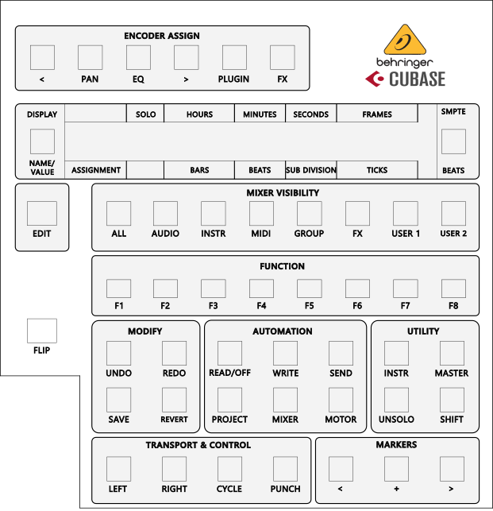
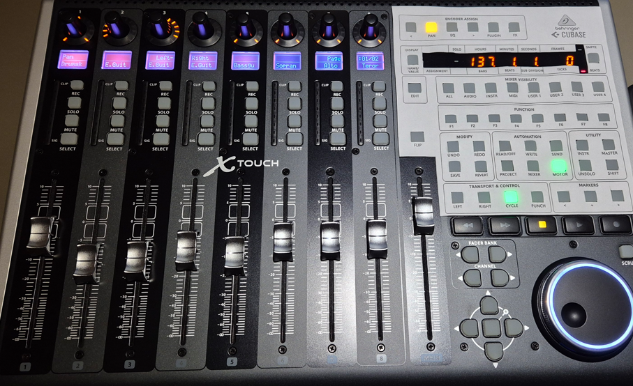

# Behringer X-Touch Cubase Overlay

This is a DIY (Do It Yourself) Behringer X-Touch MIDI controller overlay for Cubase:

I measured and created myself as I could not buy an overlay in a local store. This is how I use it:

I created this repository which is maybe useful for other X-Touch / Cubase users.

## Print

Simply print the [X-TouchCubaseOverlay.pdf](https://github.com/Erriez/x-touch-cubase-overlay/blob/main/X-TouchCubaseOverlay.pdf) and cut out the buttons and display with a nife.
Results varies when using a pair of sissors.

## Edit & customerize

To edit and customize the overlay, simply open [X-TouchCubaseOverlay.svg](https://github.com/Erriez/x-touch-cubase-overlay/blob/main/X-TouchCubaseOverlay.svg) in Inkscape (free) which can be downloaded from https://inkscape.org/.

## Profesional overlay

If someone has ideas to create a professional overlay on plastic, for example with a laser cutter, please let me know by opening an [issue](https://github.com/Erriez/x-touch-cubase-overlay/issues).

## License MIT

See [LICENSE](https://github.com/Erriez/x-touch-cubase-overlay/blob/main/LICENSE).
